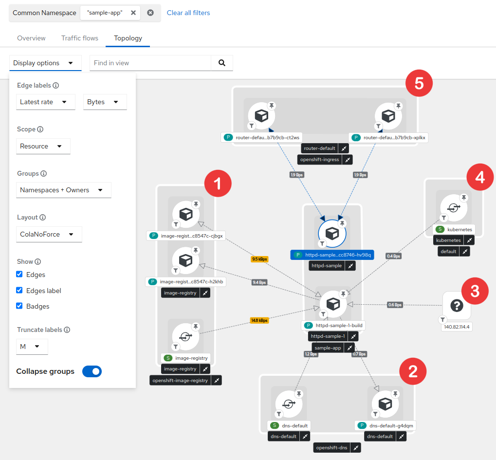

# Ways to display your Kubernetes / OpenShift network flows

By: Julien Pinsonneau

Red Hat OpenShift Container Platform (OCP) has had monitoring capabilities from the start and [Network Observability as Developer Preview](https://cloud.redhat.com/blog/a-guide-to-providing-insight-with-network-observability) since OCP 4.10 release.

Network Observability brings user interfaces in OpenShift web console administration to filter and visualize your cluster network flows as:

- Graph (top 5 flow rates stacked with total example)


- Table (showing sources and destinations sorted by time)


- Topology (using directed graph layout)


If you are interested in Network Observability for your cluster, check [official documentation for installation](TODO).

## Network representations

Topology view is a great way to understand how the different components of your cluster interact internally and identify which ones are communicating with the external world. It can also help you define your network policies or highlight potential threats.

To avoid huge and unreadable network graphs, we introduced in Network Observability multiple options to focus on the content you are looking for.

- Time range
Showing by default the last 5 minutes, it allows you to focus on a particular time window

- Filtering
To select a particular set of Source and / or Destination records such as `IPs`, `Ports`, `Protocol`, `Kind`, `Name` etc

- Level of details (named scope) 
Allowing you to select from `Node` / `Namespace` / `Owner` / `Resource` aggregating metrics into the specified layer

- Grouping 
To arrange components by their ownership

## Example of usage

What happens in your network when you deploy a [httpd sample application](https://github.com/sclorg/httpd-ex) ?



You can see that the final deployed pod in blue involved another pod called `httpd-sample-1-build` that pulled the image from `openshift-image-registry`, did some DNS resolution for provided image URL, pulled it from the resolved external IP before creating our pod through kubernetes services.

Finally, some flows are showing between our pod and `openshift-ingress` after opening the hosted page.

After moving my time window or waiting a bit, the `httpd-sample-1-build` pod disappears as it's status is now `Completed`.


## Complex representations

Sometimes we need to see more than a single application to troubleshoot network issues or to highlight bandwidth usage at cluster level.

2D network topology may start to show its limits as you need to switch between multiple options and never get an overview into a single render.


We can do the following observation from this:
- it is almost impossible to have a good overview of your entire network
- drawing each connection on a flat representation is hard to read
- it is difficult to understand ownership and relations between objects without a concrete representation

## Another dimension

Here is where [3D Topology](https://github.com/jpinsonneau/react-three-topology) makes the scene !

3D representations are pretty old and you can find a lot of them online such as [networkmaps](https://github.com/pablomarle/networkmaps), [vagrant-mesh-net](https://github.com/IMPIMBA/vagrant-mesh-net) or even more generic ones such as [splunk-3D-graph-network-topology-viz](https://github.com/splunk/splunk-3D-graph-network-topology-viz). Each of these has it's own rendering philosophy to resolve specific use cases.

This is a way to render your network using a representation everybody knows: "buildings".
```
To enable this feature in Network Observability, you will need to use Network Observability v1.0 and add "&3d=preview" in the URL. 
Then go to Topology tab -> Show advanced options -> Display options 
From there you can now select "3D" in the Layout option.
```


- **Building** drawn by dotted lines represent your `Cluster`
Every internal communication is inside these lines
Each floor is represented by a line
- **Bricks surrounding the building** in a circle shape account for `external ips`
- **Ground floor** with purple bricks represents your `Nodes`
You can have multiple nodes all located at ground level
- **Upper floors** in green shows your `Namespaces`
Namespaces are aligned between nodes so each floor represent a single namespace
If a namespace is not carried by a node, you will see an empty space
- **Rooms** stand for owners such as `Deployments` in dark blue or `StatefulSets` in light blue
You can have multiple owners per namespaces
They will repeat on each node + namespace combination if the load is distributed
- Finally, **rooms contents** depict `Pods`
These are represented in the proper node + namespace + owner combination according to its kindred


This representation emphasizes the entire ownership chain from `Node` to `Pod` passing by `Namespace`.
It also pin up how your load is balanced between nodes.


The important part of your network traffic is highlighted since lines are less likely to cross than in the 2D view and their size and color differ according to bytes rate. 
A thin black line will represent a smaller amount than a heavy red line.

TODO: 
- conclusion
- open questions on use cases
- alternative layouts
- how contribute